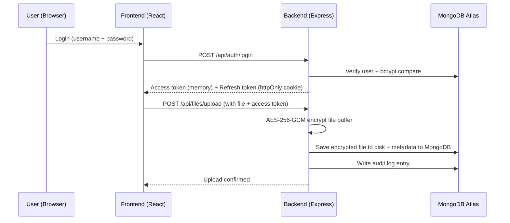

# SecureVault — Auth + Audit Logging Service

A full-stack file vault built to demonstrate practical, production-style security engineering: authentication, encryption at rest, role-based access control, and audit logging — mapped explicitly to the CIA triad (Confidentiality, Integrity, Availability).

Built as a portfolio project targeting cybersecurity / backend engineering roles.

---

## Live Demo
*(to be added)*

## Tech Stack

**Frontend:** React (Vite)
**Backend:** Node.js, Express
**Database:** MongoDB Atlas
**Auth:** JWT (access + refresh tokens), bcrypt password hashing
**Encryption:** AES-256-GCM (file encryption at rest)
**Security middleware:** express-rate-limit, express-validator

---

## Architecture Overview



## CIA Triad Mapping

| Principle | Implementation |
|---|---|
| **Confidentiality** | bcrypt password hashing (12 salt rounds) · AES-256-GCM file encryption at rest · JWT stored in memory + httpOnly cookies (XSS-resistant) · Role-based access control |
| **Integrity** | AES-GCM authentication tags (tamper detection — corrupted/modified ciphertext fails to decrypt) · Append-only audit log · Input validation on all write endpoints · Generic error messages (prevents information leakage) |
| **Availability** | Rate limiting on auth endpoints (brute-force protection) · Centralized error handling · Fail-loud database connection handling |

---

## Security Features

- **Password security:** bcrypt with 12 salt rounds; identical error message for "user not found" and "wrong password" to prevent username enumeration
- **JWT auth:** short-lived access tokens (15 min, kept in memory — never localStorage) + long-lived refresh tokens (7 days, httpOnly cookie — invisible to JavaScript, XSS-resistant)
- **File encryption:** every file encrypted with AES-256-GCM before touching disk; unique IV per file; GCM auth tag provides built-in tamper detection on decrypt
- **RBAC:** role stored on the user, baked into the JWT at login; `authorize()` middleware gates admin-only routes; owner-or-admin checks handled inline in controllers where the rule depends on the specific resource, not just the role
- **Rate limiting:** login capped at 5 attempts / 15 min per IP; registration capped at 10 / hour per IP
- **Input validation:** express-validator on registration/login (username format, password complexity, email format)
- **Audit logging:** every security-relevant action (login success/failure, registration, upload, download, delete, unauthorized access attempts) recorded with actor, timestamp, and IP — viewable via an admin-only endpoint
- **Dependency hygiene:** resolved a critical transitive CVE (`node-tar`, pulled in via bcrypt's native binary installer) using npm `overrides`, without forcing a breaking change to a direct dependency

---

## API Endpoints

| Method | Route | Auth | Description |
|---|---|---|---|
| POST | `/api/auth/register` | Public (rate-limited) | Create account |
| POST | `/api/auth/login` | Public (rate-limited) | Log in, issues tokens |
| POST | `/api/auth/refresh` | Cookie | Silently refresh access token |
| POST | `/api/auth/logout` | Public | Clear refresh cookie |
| GET | `/api/auth/me` | Protected | Current user info |
| POST | `/api/files/upload` | Protected | Upload + encrypt a file |
| GET | `/api/files` | Protected | List own files |
| GET | `/api/files/:id/download` | Protected (owner/admin) | Decrypt + download a file |
| DELETE | `/api/files/:id` | Protected (owner/admin) | Delete a file |
| GET | `/api/admin/users` | Admin only | List all users |
| GET | `/api/admin/logs` | Admin only | View audit log |

---

## Local Setup

```bash
# Backend
cd backend
npm install
# create .env with MONGO_URI, JWT_ACCESS_SECRET, JWT_REFRESH_SECRET, ENCRYPTION_KEY, BCRYPT_SALT_ROUNDS
npm run dev

# Frontend
cd frontend
npm install
npm run dev
```

Runs at `http://localhost:5173` (frontend) / `http://localhost:5000` (backend).

---

## Known Limitations

Documented deliberately — a realistic project has tradeoffs, and naming them shows engineering judgment rather than gaps to hide:

- No refresh-token revocation list — a stolen refresh token remains valid for its full 7-day lifetime. Production would store token hashes server-side to allow immediate revocation.
- No password reset flow yet (planned as a follow-up — email-based reset with a hashed, single-use, time-limited token, following the same pattern as password hashing).
- No MFA — evaluated and deliberately deprioritized in favor of the features above, given time constraints; a reasonable next addition.
- Rate limiting is in-memory (per server instance) — a multi-instance production deployment would need a shared store (e.g. Redis).

---

## Screenshots


